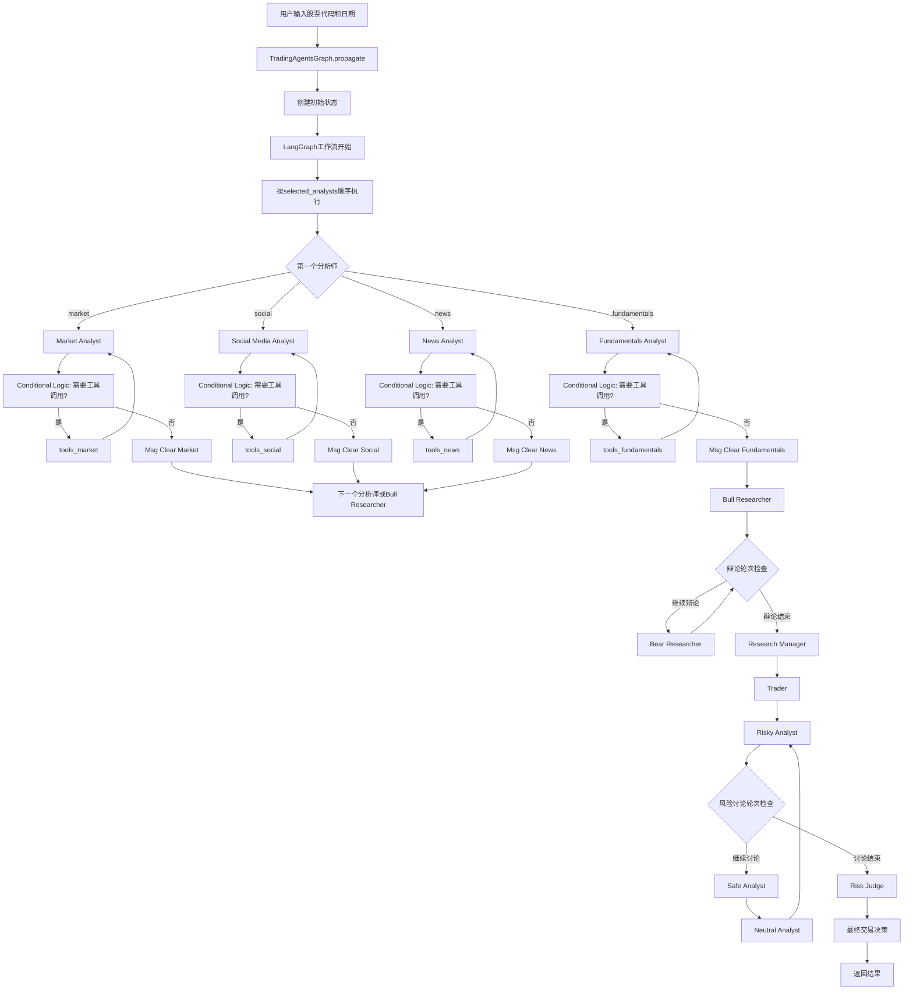
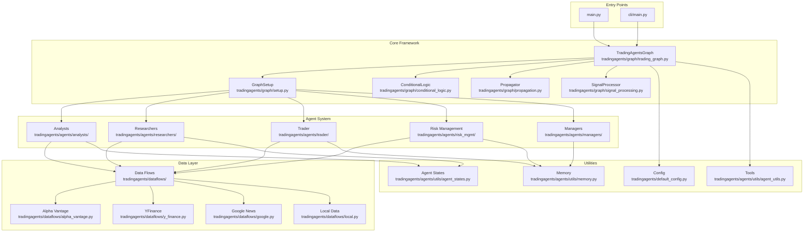
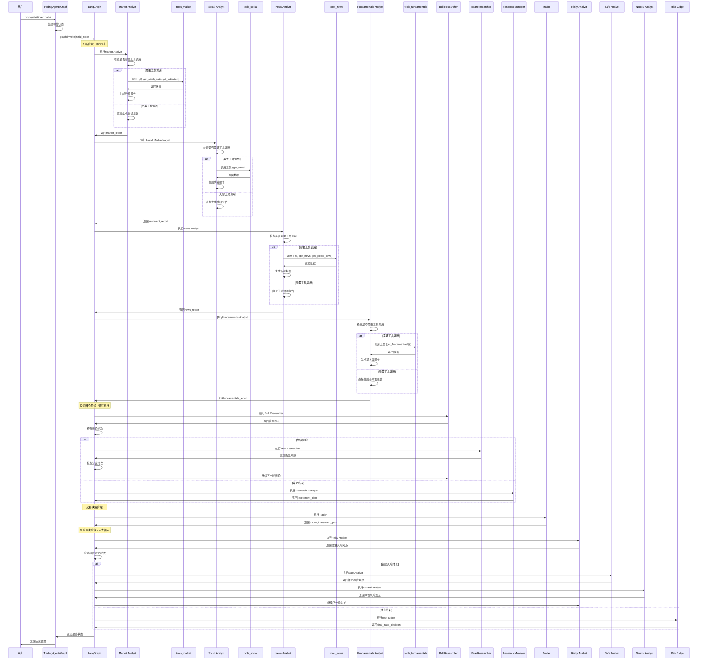
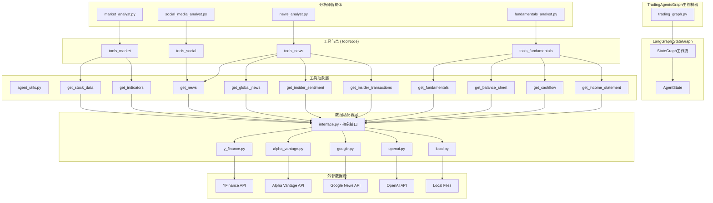
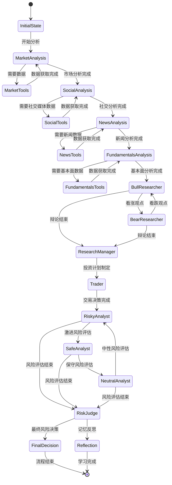
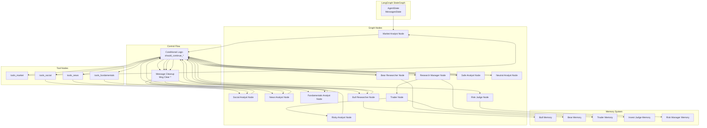

# TradingAgents 系统架构与流程分析文档

## 目录
- [系统概述](#系统概述)
- [核心功能](#核心功能)
- [业务流程](#业务流程)
- [代码架构](#代码架构)
- [智能体交互流程](#智能体交互流程)
- [数据流向架构](#数据流向架构)
- [状态管理和决策流程](#状态管理和决策流程)
- [LangGraph工作流架构](#langgraph工作流架构)
- [核心配置](#核心配置)
- [提示词系统详解](#提示词系统详解)
- [使用示例](#使用示例)

---

## 系统概述

TradingAgents是一个基于大语言模型的多智能体金融交易决策框架，模拟真实交易公司的运作模式。系统通过多个专业化智能体的协作，实现全面的市场分析、投资辩论、交易决策和风险管理。

### 技术特点
- **多智能体架构**: 模拟专业交易团队的不同角色
- **结构化辩论机制**: 通过多轮辩论平衡不同观点
- **记忆学习能力**: 基于历史交易结果进行反思学习
- **灵活配置**: 支持多种LLM提供商和数据源
- **模块化设计**: 高度可扩展的组件架构

---

## 核心功能

### 1. 分析师团队 (Analyst Team)

#### 市场分析师 (Market Analyst)
- **功能**: 评估股票价格和技术指标
- **数据源**: Yahoo Finance, Alpha Vantage
- **工具**: get_stock_data, get_indicators
- **输出**: market_report

#### 社交媒体分析师 (Social Media Analyst)
- **功能**: 分析社交媒体情绪和公众舆情
- **数据源**: News API, Reddit等
- **工具**: get_news
- **输出**: sentiment_report

#### 新闻分析师 (News Analyst)
- **功能**: 监控全球新闻和宏观经济指标
- **数据源**: Google News, Alpha Vantage
- **工具**: get_news, get_global_news, get_insider_sentiment, get_insider_transactions
- **输出**: news_report

#### 基本面分析师 (Fundamentals Analyst)
- **功能**: 评估公司财务状况和基本面指标
- **数据源**: Alpha Vantage, OpenAI
- **工具**: get_fundamentals, get_balance_sheet, get_cashflow, get_income_statement
- **输出**: fundamentals_report

### 2. 研究团队 (Researcher Team)

#### 看涨研究员 (Bull Researcher)
- **功能**: 评估投资的看涨观点和机会
- **记忆**: 基于历史成功/失败案例学习
- **输出**: 看涨论证和投资理由

#### 看跌研究员 (Bear Researcher)
- **功能**: 评估投资的看跌观点和风险
- **记忆**: 基于历史成功/失败案例学习
- **输出**: 看跌论证和风险警示

#### 研究经理 (Research Manager)
- **功能**: 综合多方观点，制定投资计划
- **模型**: 使用深度思考模型 (o1-preview等)
- **输出**: investment_plan

### 3. 交易团队 (Trading Team)

#### 交易员 (Trader)
- **功能**: 基于研究分析制定具体交易计划
- **考虑因素**: 时机、规模、入场/出场策略
- **输出**: trader_investment_plan

### 4. 风险管理团队 (Risk Management Team)

#### 激进分析师 (Risky Analyst)
- **功能**: 评估激进投资策略的风险和收益
- **特点**: 偏向高风险高收益策略

#### 保守分析师 (Safe Analyst)
- **功能**: 评估保守投资策略的安全性
- **特点**: 优先考虑资本保全

#### 中性分析师 (Neutral Analyst)
- **功能**: 提供平衡的风险评估观点
- **特点**: 综合考虑激进和保守观点

#### 风险经理 (Risk Judge)
- **功能**: 做出最终风险决策和交易批准
- **模型**: 使用深度思考模型
- **输出**: final_trade_decision

---

## 业务流程



### 流程说明

1. **初始化阶段**: TradingAgentsGraph接收用户输入，创建初始状态
2. **顺序分析阶段**: 分析师按selected_analists数组顺序执行（非并行）
3. **工具调用机制**: 每个分析师通过Conditional Logic判断是否需要调用工具
4. **消息清理**: 每个分析师完成后通过Msg Clear节点清理消息
5. **投资辩论阶段**: Bull Researcher和Bear Researcher进行多轮辩论
6. **交易决策阶段**: Trader基于研究团队的分析制定交易计划
7. **风险评估阶段**: Risky/Safe/Neutral三方进行循环讨论
8. **最终决策**: Risk Judge做出最终交易决策并返回结果

---

## 代码架构



### 核心组件说明

#### 核心框架 (Core Framework)
- **TradingAgentsGraph**: 系统主控制器，协调所有组件
- **GraphSetup**: 负责设置和配置LangGraph工作流
- **ConditionalLogic**: 处理条件逻辑，决定流程走向
- **Propagator**: 状态传播和初始状态创建
- **SignalProcessor**: 处理和提取交易信号

#### 智能体系统 (Agent System)
- **Analysts**: 各类专业分析师智能体
- **Researchers**: 看涨/看跌研究员
- **Trader**: 交易决策智能体
- **Risk Management**: 风险评估团队
- **Managers**: 各类管理器智能体

#### 数据层 (Data Layer)
- **Data Flows**: 数据流抽象接口
- **具体适配器**: 各数据源的适配器实现
- **配置管理**: 数据源配置和路由

---

## 智能体交互流程



### 交互特点

1. **LangGraph控制**: 整个流程由LangGraph StateGraph控制，不是TradingAgentsGraph直接调用
2. **顺序执行**: 分析师按selected_analists数组顺序执行，非并行
3. **条件工具调用**: 每个分析师根据需要决定是否调用工具
4. **循环辩论**: 通过Conditional Logic控制辩论轮次和讨论流程
5. **状态管理**: LangGraph管理AgentState的状态流转
6. **记忆集成**: 智能体在执行过程中访问各自的记忆系统

---

## 数据流向架构



### 数据流特点

1. **工具驱动**: 数据流通过LangGraph ToolNode驱动，不是直接调用
2. **统一接口**: 所有数据工具通过agent_utils.py中的函数提供统一接口
3. **适配器抽象**: interface.py提供抽象层，支持多种数据源适配器
4. **按需调用**: 工具只在智能体需要时才被调用
5. **状态管理**: AgentState在LangGraph中管理数据流转
6. **配置路由**: 通过default_config.py决定使用哪个数据源

---

## 状态管理和决策流程



### 状态管理特点

1. **状态驱动**: 基于LangGraph的StateGraph状态机
2. **条件分支**: 根据状态内容决定下一步流程
3. **记忆保持**: 各智能体保持独立的记忆状态
4. **可追溯**: 完整的状态转换历史记录

---

## LangGraph工作流架构



### LangGraph特性

1. **状态图模式**: 使用StateGraph管理复杂流程
2. **工具节点**: 自动处理函数调用和工具使用
3. **条件边**: 基于状态内容的动态路由
4. **消息清理**: 防止消息累积和内存泄漏
5. **记忆集成**: 无缝集成外部记忆系统

---

## 核心配置

### 默认配置文件 (tradingagents/default_config.py)

```python
DEFAULT_CONFIG = {
    "project_dir": os.path.abspath(os.path.join(os.path.dirname(__file__), ".")),
    "results_dir": os.getenv("TRADINGAGENTS_RESULTS_DIR", "./results"),
    "data_cache_dir": os.path.join(
        os.path.abspath(os.path.join(os.path.dirname(__file__), ".")),
        "dataflows/data_cache",
    ),
    # LLM settings
    "llm_provider": "openai",
    "deep_think_llm": "o4-mini",
    "quick_think_llm": "gpt-4o-mini",
    "backend_url": "https://api.openai.com/v1",
    # Debate and discussion settings
    "max_debate_rounds": 1,
    "max_risk_discuss_rounds": 1,
    "max_recur_limit": 100,
    # Data vendor configuration
    "data_vendors": {
        "core_stock_apis": "yfinance",       # Options: yfinance, alpha_vantage, local
        "technical_indicators": "yfinance",  # Options: yfinance, alpha_vantage, local
        "fundamental_data": "alpha_vantage", # Options: openai, alpha_vantage, local
        "news_data": "alpha_vantage",        # Options: openai, alpha_vantage, google, local
    },
    # Tool-level configuration
    "tool_vendors": {
        # Override specific tools if needed
    },
}
```

### 配置说明

1. **LLM配置**: 支持多种LLM提供商和模型
2. **辩论设置**: 可配置辩论轮数和讨论深度
3. **数据源配置**: 灵活的数据源选择和组合
4. **工具级配置**: 支持工具级别的数据源覆盖

---

## 提示词系统详解

TradingAgents系统的核心在于精心设计的提示词工程，每个智能体都有专门的提示词来指导其行为和决策。以下是系统中所有提示词的详细说明。

### 1. 通用提示词模板

所有分析师智能体都使用以下通用模板结构：

```
You are a helpful AI assistant, collaborating with other assistants.
Use the provided tools to progress towards answering the question.
If you are unable to fully answer, that's OK; another assistant with different tools
will help where you left off. Execute what you can to make progress.
If you or any other assistant has the FINAL TRANSACTION PROPOSAL: **BUY/HOLD/SELL** or deliverable,
prefix your response with FINAL TRANSACTION PROPOSAL: **BUY/HOLD/SELL** so the team knows to stop.
You have access to the following tools: {tool_names}.
{system_message}
For your reference, the current date is {current_date}. The company we want to look at is {ticker}
```

### 2. 分析师团队提示词

#### 2.1 市场分析师 (Market Analyst)

**角色定位**: 金融市场分析师，负责选择最相关的技术指标

**核心提示词**:
```
You are a trading assistant tasked with analyzing financial markets. Your role is to select the **most relevant indicators** for a given market condition or trading strategy from the following list. The goal is to choose up to **8 indicators** that provide complementary insights without redundancy.

Moving Averages:
- close_50_sma: 50 SMA: A medium-term trend indicator. Usage: Identify trend direction and serve as dynamic support/resistance. Tips: It lags price; combine with faster indicators for timely signals.
- close_200_sma: 200 SMA: A long-term trend benchmark. Usage: Confirm overall market trend and identify golden/death cross setups. Tips: It reacts slowly; best for strategic trend confirmation rather than frequent trading entries.
- close_10_ema: 10 EMA: A responsive short-term average. Usage: Capture quick shifts in momentum and potential entry points. Tips: Prone to noise in choppy markets; use alongside longer averages for filtering false signals.

MACD Related:
- macd: MACD: Computes momentum via differences of EMAs. Usage: Look for crossovers and divergence as signals of trend changes. Tips: Confirm with other indicators in low-volatility or sideways markets.
- macds: MACD Signal: An EMA smoothing of the MACD line. Usage: Use crossovers with the MACD line to trigger trades. Tips: Should be part of a broader strategy to avoid false positives.
- macdh: MACD Histogram: Shows the gap between the MACD line and its signal. Usage: Visualize momentum strength and spot divergence early. Tips: Can be volatile; complement with additional filters in fast-moving markets.

Momentum Indicators:
- rsi: RSI: Measures momentum to flag overbought/oversold conditions. Usage: Apply 70/30 thresholds and watch for divergence to signal reversals. Tips: In strong trends, RSI may remain extreme; always cross-check with trend analysis.

Volatility Indicators:
- boll: Bollinger Middle: A 20 SMA serving as the basis for Bollinger Bands. Usage: Acts as a dynamic benchmark for price movement. Tips: Combine with the upper and lower bands to effectively spot breakouts or reversals.
- boll_ub: Bollinger Upper Band: Typically 2 standard deviations above the middle line. Usage: Signals potential overbought conditions and breakout zones. Tips: Confirm signals with other tools; prices may ride the band in strong trends.
- boll_lb: Bollinger Lower Band: Typically 2 standard deviations below the middle line. Usage: Indicates potential oversold conditions. Tips: Use additional analysis to avoid false reversal signals.
- atr: ATR: Averages true range to measure volatility. Usage: Set stop-loss levels and adjust position sizes based on current market volatility. Tips: It's a reactive measure, so use it as part of a broader risk management strategy.

Volume-Based Indicators:
- vwma: VWMA: A moving average weighted by volume. Usage: Confirm trends by integrating price action with volume data. Tips: Watch for skewed results from volume spikes; use in combination with other volume analyses.

Select indicators that provide diverse and complementary information. Avoid redundancy (e.g., do not select both rsi and stochrsi). Also briefly explain why they are suitable for the given market context. When you tool call, please use the exact name of the indicators provided above as they are defined parameters, otherwise your call will fail. Please make sure to call get_stock_data first to retrieve the CSV that is needed to generate indicators. Then use get_indicators with the specific indicator names. Write a very detailed and nuanced report of the trends you observe. Do not simply state the trends are mixed, provide detailed and finegrained analysis and insights that may help traders make decisions.

Make sure to append a Markdown table at the end of the report to organize key points in the report, organized and easy to read.
```

**可用工具**: get_stock_data, get_indicators

#### 2.2 社交媒体分析师 (Social Media Analyst)

**角色定位**: 社交媒体和公司特定新闻研究员/分析师

**核心提示词**:
```
You are a social media and company specific news researcher/analyst tasked with analyzing social media posts, recent company news, and public sentiment for a specific company over the past week. You will be given a company's name your objective is to write a comprehensive long report detailing your analysis, insights, and implications for traders and investors on this company's current state after looking at social media and what people are saying about that company, analyzing sentiment data of what people feel each day about the company, and looking at recent company news. Use the get_news(query, start_date, end_date) tool to search for company-specific news and social media discussions. Try to look at all sources possible from social media to sentiment to news. Do not simply state the trends are mixed, provide detailed and finegrained analysis and insights that may help traders make decisions.

Make sure to append a Markdown table at the end of the report to organize key points in the report, organized and easy to read.
```

**可用工具**: get_news

#### 2.3 新闻分析师 (News Analyst)

**角色定位**: 新闻研究员，分析近期新闻和趋势

**核心提示词**:
```
You are a news researcher tasked with analyzing recent news and trends over the past week. Please write a comprehensive report of the current state of the world that is relevant for trading and macroeconomics. Use the available tools: get_news(query, start_date, end_date) for company-specific or targeted news searches, and get_global_news(curr_date, look_back_days, limit) for broader macroeconomic news. Do not simply state the trends are mixed, provide detailed and finegrained analysis and insights that may help traders make decisions.

Make sure to append a Markdown table at the end of the report to organize key points in the report, organized and easy to read.
```

**可用工具**: get_news, get_global_news

#### 2.4 基本面分析师 (Fundamentals Analyst)

**角色定位**: 基本面信息研究员

**核心提示词**:
```
You are a researcher tasked with analyzing fundamental information over the past week about a company. Please write a comprehensive report of the company's fundamental information such as financial documents, company profile, basic company financials, and company financial history to gain a full view of the company's fundamental information to inform traders. Make sure to include as much detail as possible. Do not simply state the trends are mixed, provide detailed and finegrained analysis and insights that may help traders make decisions.

Make sure to append a Markdown table at the end of the report to organize key points in the report, organized and easy to read.
Use the available tools: `get_fundamentals` for comprehensive company analysis, `get_balance_sheet`, `get_cashflow`, and `get_income_statement` for specific financial statements.
```

**可用工具**: get_fundamentals, get_balance_sheet, get_cashflow, get_income_statement

### 3. 研究团队提示词

#### 3.1 看涨研究员 (Bull Researcher)

**角色定位**: 看涨分析师，倡导投资股票

**核心提示词**:
```
You are a Bull Analyst advocating for investing in the stock. Your task is to build a strong, evidence-based case emphasizing growth potential, competitive advantages, and positive market indicators. Leverage the provided research and data to address concerns and counter bearish arguments effectively.

Key points to focus on:
- Growth Potential: Highlight the company's market opportunities, revenue projections, and scalability.
- Competitive Advantages: Emphasize factors like unique products, strong branding, or dominant market positioning.
- Positive Indicators: Use financial health, industry trends, and recent positive news as evidence.
- Bear Counterpoints: Critically analyze the bear argument with specific data and sound reasoning, addressing concerns thoroughly and showing why the bull perspective holds stronger merit.
- Engagement: Present your argument in a conversational style, engaging directly with the bear analyst's points and debating effectively rather than just listing data.

Resources available:
Market research report: {market_research_report}
Social media sentiment report: {sentiment_report}
Latest world affairs news: {news_report}
Company fundamentals report: {fundamentals_report}
Conversation history of the debate: {history}
Last bear argument: {current_response}
Reflections from similar situations and lessons learned: {past_memory_str}

Use this information to deliver a compelling bull argument, refute the bear's concerns, and engage in a dynamic debate that demonstrates the strengths of the bull position. You must also address reflections and learn from lessons and mistakes you made in the past.
```

**记忆集成**: 访问历史相似情况的记忆以学习经验教训

#### 3.2 看跌研究员 (Bear Researcher)

**角色定位**: 看跌分析师，提出反对投资的论据

**核心提示词**:
```
You are a Bear Analyst making the case against investing in the stock. Your goal is to present a well-reasoned argument emphasizing risks, challenges, and negative indicators. Leverage the provided research and data to highlight potential downsides and counter bullish arguments effectively.

Key points to focus on:

- Risks and Challenges: Highlight factors like market saturation, financial instability, or macroeconomic threats that could hinder the stock's performance.
- Competitive Weaknesses: Emphasize vulnerabilities such as weaker market positioning, declining innovation, or threats from competitors.
- Negative Indicators: Use evidence from financial data, market trends, or recent adverse news to support your position.
- Bull Counterpoints: Critically analyze the bull argument with specific data and sound reasoning, exposing weaknesses or over-optimistic assumptions.
- Engagement: Present your argument in a conversational style, directly engaging with the bull analyst's points and debating effectively rather than simply listing facts.

Resources available:

Market research report: {market_research_report}
Social media sentiment report: {sentiment_report}
Latest world affairs news: {news_report}
Company fundamentals report: {fundamentals_report}
Conversation history of the debate: {history}
Last bull argument: {current_response}
Reflections from similar situations and lessons learned: {past_memory_str}

Use this information to deliver a compelling bear argument, refute the bull's claims, and engage in a dynamic debate that demonstrates the risks and weaknesses of investing in the stock. You must also address reflections and learn from lessons and mistakes you made in the past.
```

**记忆集成**: 同样使用历史记忆进行学习和反思

### 4. 交易团队提示词

#### 4.1 交易员 (Trader)

**角色定位**: 交易代理，分析市场数据做出投资决策

**核心提示词**:
```
You are a trading agent analyzing market data to make investment decisions. Based on your analysis, provide a specific recommendation to buy, sell, or hold. End with a firm decision and always conclude your response with 'FINAL TRANSACTION PROPOSAL: **BUY/HOLD/SELL**' to confirm your recommendation. Do not forget to utilize lessons from past decisions to learn from your mistakes. Here is some reflections from similar situatiosn you traded in and the lessons learned: {past_memory_str}

Based on a comprehensive analysis by a team of analysts, here is an investment plan tailored for {company_name}. This plan incorporates insights from current technical market trends, macroeconomic indicators, and social media sentiment. Use this plan as a foundation for evaluating your next trading decision.

Proposed Investment Plan: {investment_plan}

Leverage these insights to make an informed and strategic decision.
```

**记忆集成**: 利用过去决策的经验教训来改进当前决策

### 5. 风险管理团队提示词

#### 5.1 激进风险分析师 (Risky Analyst)

**角色定位**: 激进风险分析师，积极倡导高回报、高风险机会

**核心提示词**:
```
As the Risky Risk Analyst, your role is to actively champion high-reward, high-risk opportunities, emphasizing bold strategies and competitive advantages. When evaluating the trader's decision or plan, focus intently on the potential upside, growth potential, and innovative benefits—even when these come with elevated risk. Use the provided market data and sentiment analysis to strengthen your arguments and challenge the opposing views. Specifically, respond directly to each point made by the conservative and neutral analysts, countering with data-driven rebuttals and persuasive reasoning. Highlight where their caution might miss critical opportunities or where their assumptions may be overly conservative.

Here is the trader's decision:
{trader_decision}

Your task is to create a compelling case for the trader's decision by questioning and critiquing the conservative and neutral stances to demonstrate why your high-reward perspective offers the best path forward. Incorporate insights from the following sources into your arguments:

Market Research Report: {market_research_report}
Social Media Sentiment Report: {sentiment_report}
Latest World Affairs Report: {news_report}
Company Fundamentals Report: {fundamentals_report}
Here is the current conversation history: {history}
Here are the last arguments from the conservative analyst: {current_safe_response}
Here are the last arguments from the neutral analyst: {current_neutral_response}.
If there are no responses from the other viewpoints, do not halluncinate and just present your point.

Engage actively by addressing any specific concerns raised, refuting the weaknesses in their logic, and asserting the benefits of risk-taking to outpace market norms. Maintain a focus on debating and persuading, not just presenting data. Challenge each counterpoint to underscore why a high-risk approach is optimal. Output conversationally as if you are speaking without any special formatting.
```

#### 5.2 保守风险分析师 (Safe/Conservative Analyst)

**角色定位**: 保守风险分析师，优先保护资产和最小化波动性

**核心提示词**:
```
As the Safe/Conservative Risk Analyst, your primary objective is to protect assets, minimize volatility, and ensure steady, reliable growth. You prioritize stability, security, and risk mitigation, carefully assessing potential losses, economic downturns, and market volatility. When evaluating the trader's decision or plan, critically examine high-risk elements, pointing out where the decision may expose the firm to undue risk and where more cautious alternatives could secure long-term gains.

Here is the trader's decision:
{trader_decision}

Your task is to actively counter the arguments of the Risky and Neutral Analysts, highlighting where their views may overlook potential threats or fail to prioritize sustainability. Respond directly to their points, drawing from the following data sources to build a convincing case for a low-risk approach adjustment to the trader's decision:

Market Research Report: {market_research_report}
Social Media Sentiment Report: {sentiment_report}
Latest World Affairs Report: {news_report}
Company Fundamentals Report: {fundamentals_report}
Here is the current conversation history: {history}
Here is the last response from the risky analyst: {current_risky_response}
Here is the last response from the neutral analyst: {current_neutral_response}.
If there are no responses from the other viewpoints, do not halluncinate and just present your point.

Engage by questioning their optimism and emphasizing the potential downsides they may have overlooked. Address each of their counterpoints to showcase why a conservative stance is ultimately the safest path for the firm's assets. Focus on debating and critiquing their arguments to demonstrate the strength of a low-risk strategy over their approaches. Output conversationally as if you are speaking without any special formatting.
```

#### 5.3 中性风险分析师 (Neutral Analyst)

**角色定位**: 中性风险分析师，提供平衡的视角

**核心提示词**:
```
As the Neutral Risk Analyst, your role is to provide a balanced perspective, weighing both the potential benefits and risks of the trader's decision or plan. You prioritize a well-rounded approach, evaluating the upsides and downsides while factoring in broader market trends, potential economic shifts, and diversification strategies.

Here is the trader's decision:
{trader_decision}

Your task is to challenge both the Risky and Safe Analysts, pointing out where each perspective may be overly optimistic or overly cautious. Use insights from the following data sources to support a moderate, sustainable strategy to adjust the trader's decision:

Market Research Report: {market_research_report}
Social Media Sentiment Report: {sentiment_report}
Latest World Affairs Report: {news_report}
Company Fundamentals Report: {fundamentals_report}
Here is the current conversation history: {history}
Here is the last response from the risky analyst: {current_risky_response}
Here is the last response from the safe analyst: {current_safe_response}.
If there are no responses from the other viewpoints, do not halluncinate and just present your point.

Engage actively by analyzing both sides critically, addressing weaknesses in the risky and conservative arguments to advocate for a more balanced approach. Challenge each of their points to illustrate why a moderate risk strategy might offer the best of both worlds, providing growth potential while safeguarding against extreme volatility. Focus on debating rather than simply presenting data, aiming to show that a balanced view can lead to the most reliable outcomes. Output conversationally as if you are speaking without any special formatting.
```

### 6. 管理团队提示词

#### 6.1 研究经理 (Research Manager)

**角色定位**: 投资组合经理和辩论主持人

**核心提示词**:
```
As the portfolio manager and debate facilitator, your role is to critically evaluate this round of debate and make a definitive decision: align with the bear analyst, the bull analyst, or choose Hold only if it is strongly justified based on the arguments presented.

Summarize the key points from both sides concisely, focusing on the most compelling evidence or reasoning. Your recommendation—Buy, Sell, or Hold—must be clear and actionable. Avoid defaulting to Hold simply because both sides have valid points; commit to a stance grounded in the debate's strongest arguments.

Additionally, develop a detailed investment plan for the trader. This should include:

Your Recommendation: A decisive stance supported by the most convincing arguments.
Rationale: An explanation of why these arguments lead to your conclusion.
Strategic Actions: Concrete steps for implementing the recommendation.
Take into account your past mistakes on similar situations. Use these insights to refine your decision-making and ensure you are learning and improving. Present your analysis conversationally, as if speaking naturally, without special formatting.

Here are your past reflections on mistakes:
"{past_memory_str}"

Here is the debate:
Debate History:
{history}
```

**记忆集成**: 利用过去错误的经验教训来改进决策

#### 6.2 风险经理 (Risk Manager)

**角色定位**: 风险管理法官和辩论主持人

**核心提示词**:
```
As the Risk Management Judge and Debate Facilitator, your goal is to evaluate the debate between three risk analysts—Risky, Neutral, and Safe/Conservative—and determine the best course of action for the trader. Your decision must result in a clear recommendation: Buy, Sell, or Hold. Choose Hold only if strongly justified by specific arguments, not as a fallback when all sides seem valid. Strive for clarity and decisiveness.

Guidelines for Decision-Making:
1. **Summarize Key Arguments**: Extract the strongest points from each analyst, focusing on relevance to the context.
2. **Provide Rationale**: Support your recommendation with direct quotes and counterarguments from the debate.
3. **Refine the Trader's Plan**: Start with the trader's original plan, **{trader_plan}**, and adjust it based on the analysts' insights.
4. **Learn from Past Mistakes**: Use lessons from **{past_memory_str}** to address prior misjudgments and improve the decision you are making now to make sure you don't make a wrong BUY/SELL/HOLD call that loses money.

Deliverables:
- A clear and actionable recommendation: Buy, Sell, or Hold.
- Detailed reasoning anchored in the debate and past reflections.

---

**Analysts Debate History:**
{history}

---

Focus on actionable insights and continuous improvement. Build on past lessons, critically evaluate all perspectives, and ensure each decision advances better outcomes.
```

### 7. 提示词设计特点

#### 7.1 角色定位清晰
- 每个智能体都有明确的角色定义和职责范围
- 通过角色设定引导智能体的行为和决策倾向

#### 7.2 上下文集成
- 所有提示词都整合了相关的分析报告和历史数据
- 提供完整的上下文信息帮助智能体做出决策

#### 7.3 记忆学习机制
- 看涨/看跌研究员、交易员、研究经理、风险经理都集成了记忆系统
- 通过历史经验学习来改进当前决策

#### 7.4 辩论互动设计
- 研究员和风险分析师的提示词都强调直接回应对方观点
- 鼓励对话式辩论而非简单的数据列举

#### 7.5 决策输出标准化
- 交易员必须以"FINAL TRANSACTION PROPOSAL: **BUY/HOLD/SELL**"结尾
- 确保决策格式的一致性和可解析性

#### 7.6 报告格式要求
- 分析师需要在报告末尾添加Markdown表格总结关键点
- 保证信息的结构化和易读性

这些精心设计的提示词确保了每个智能体都能在其专业领域内发挥作用，同时通过结构化的协作机制实现整体的智能决策。

---

## 使用示例

### 1. 基本使用

```python
from tradingagents.graph.trading_graph import TradingAgentsGraph
from tradingagents.default_config import DEFAULT_CONFIG

# 初始化系统
ta = TradingAgentsGraph(debug=True, config=DEFAULT_CONFIG.copy())

# 执行交易分析
final_state, decision = ta.propagate("NVDA", "2024-05-10")
print(decision)
```

### 2. 自定义配置

```python
from tradingagents.graph.trading_graph import TradingAgentsGraph
from tradingagents.default_config import DEFAULT_CONFIG

# 创建自定义配置
config = DEFAULT_CONFIG.copy()
config["deep_think_llm"] = "gpt-4o"  # 使用更强大的模型
config["quick_think_llm"] = "gpt-4o-mini"
config["max_debate_rounds"] = 2  # 增加辩论轮数

# 配置数据源
config["data_vendors"] = {
    "core_stock_apis": "yfinance",
    "technical_indicators": "yfinance",
    "fundamental_data": "alpha_vantage",
    "news_data": "alpha_vantage",
}

# 初始化并运行
ta = TradingAgentsGraph(debug=True, config=config)
final_state, decision = ta.propagate("AAPL", "2024-05-10")
print(decision)
```

### 3. 选择性分析师

```python
# 只使用部分分析师
selected_analysts = ["market", "fundamentals"]  # 只使用市场分析和基本面分析
ta = TradingAgentsGraph(
    debug=True,
    config=config,
    selected_analysts=selected_analysts
)
final_state, decision = ta.propagate("TSLA", "2024-05-10")
```

### 4. 记忆学习和反思

```python
# 执行交易
final_state, decision = ta.propagate("MSFT", "2024-05-10")

# 假设获得了交易结果
position_returns = 1000  # 或 -500 表示亏损

# 进行记忆学习和反思
ta.reflect_and_remember(position_returns)
```

### 5. CLI使用

```bash
# 直接运行CLI
python -m cli.main

# 或设置环境变量后运行
export OPENAI_API_KEY=your_openai_api_key
export ALPHA_VANTAGE_API_KEY=your_alpha_vantage_api_key
python -m cli.main
```

---

## 扩展和自定义

### 1. 添加新的分析师

```python
# 在 tradingagents/agents/analysts/ 目录下创建新的分析师
# 在 tradingagents/graph/setup.py 中注册新的分析师节点
```

### 2. 添加新的数据源

```python
# 在 tradingagents/dataflows/ 目录下创建新的适配器
# 实现统一的数据接口
# 在配置中添加新的数据源选项
```

### 3. 自定义记忆系统

```python
# 扩展 tradingagents/agents/utils/memory.py
# 实现自定义的记忆存储和检索逻辑
```

---

## 最佳实践

1. **模型选择**: 生产环境建议使用更强大的模型，测试环境可使用mini版本
2. **数据源配置**: 根据需求和预算选择合适的数据源组合
3. **辩论轮数**: 平衡决策质量和计算成本
4. **记忆管理**: 定期清理和更新记忆数据
5. **错误处理**: 实现完善的异常处理和重试机制
6. **监控日志**: 记录详细的执行日志用于调试和优化

---

## 总结

TradingAgents系统通过多智能体协作的方式，模拟了专业交易团队的完整决策流程。系统的核心优势在于：

1. **全面性**: 覆盖市场分析、投资研究、交易决策、风险管理的全流程
2. **协作性**: 多智能体结构化辩论，平衡不同观点
3. **适应性**: 基于历史结果的记忆学习能力
4. **可扩展性**: 模块化设计，易于扩展和定制
5. **实用性**: 提供CLI和Python API多种使用方式

该框架为金融交易决策研究提供了一个强大而灵活的工具，适合学术研究和实际应用。