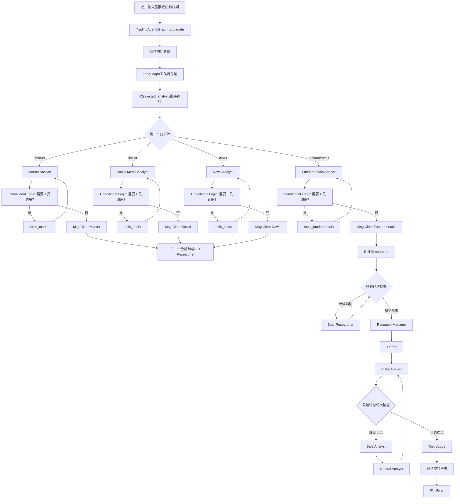
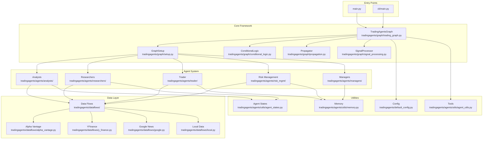
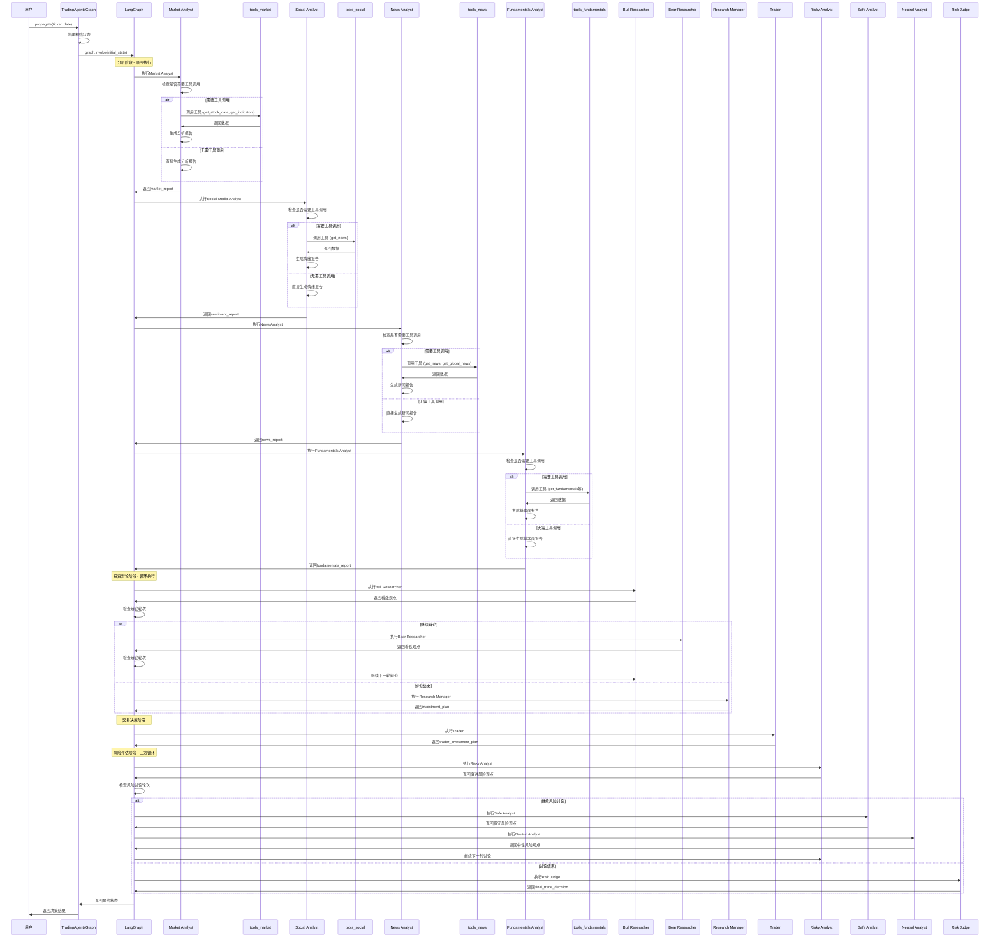
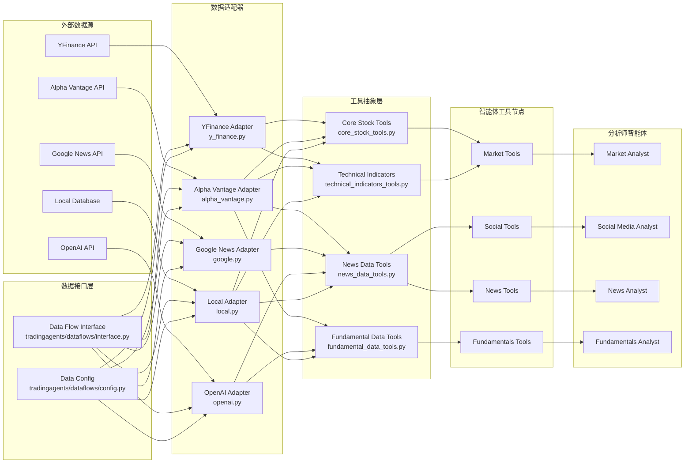
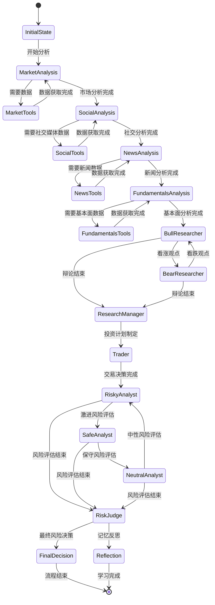
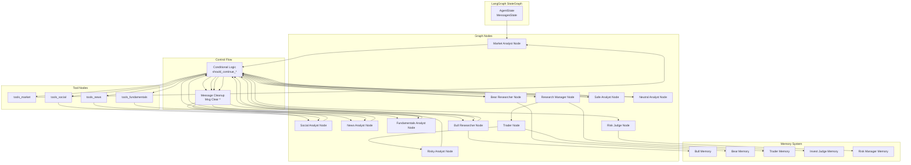

# TradingAgents 系统架构与流程分析文档

## 目录
- [系统概述](#系统概述)
- [核心功能](#核心功能)
- [业务流程](#业务流程)
- [代码架构](#代码架构)
- [智能体交互流程](#智能体交互流程)
- [数据流向架构](#数据流向架构)
- [状态管理和决策流程](#状态管理和决策流程)
- [LangGraph工作流架构](#langgraph工作流架构)
- [核心配置](#核心配置)
- [使用示例](#使用示例)

---

## 系统概述

TradingAgents是一个基于大语言模型的多智能体金融交易决策框架，模拟真实交易公司的运作模式。系统通过多个专业化智能体的协作，实现全面的市场分析、投资辩论、交易决策和风险管理。

### 技术特点
- **多智能体架构**: 模拟专业交易团队的不同角色
- **结构化辩论机制**: 通过多轮辩论平衡不同观点
- **记忆学习能力**: 基于历史交易结果进行反思学习
- **灵活配置**: 支持多种LLM提供商和数据源
- **模块化设计**: 高度可扩展的组件架构

---

## 核心功能

### 1. 分析师团队 (Analyst Team)

#### 市场分析师 (Market Analyst)
- **功能**: 评估股票价格和技术指标
- **数据源**: Yahoo Finance, Alpha Vantage
- **工具**: get_stock_data, get_indicators
- **输出**: market_report

#### 社交媒体分析师 (Social Media Analyst)
- **功能**: 分析社交媒体情绪和公众舆情
- **数据源**: News API, Reddit等
- **工具**: get_news
- **输出**: sentiment_report

#### 新闻分析师 (News Analyst)
- **功能**: 监控全球新闻和宏观经济指标
- **数据源**: Google News, Alpha Vantage
- **工具**: get_news, get_global_news, get_insider_sentiment, get_insider_transactions
- **输出**: news_report

#### 基本面分析师 (Fundamentals Analyst)
- **功能**: 评估公司财务状况和基本面指标
- **数据源**: Alpha Vantage, OpenAI
- **工具**: get_fundamentals, get_balance_sheet, get_cashflow, get_income_statement
- **输出**: fundamentals_report

### 2. 研究团队 (Researcher Team)

#### 看涨研究员 (Bull Researcher)
- **功能**: 评估投资的看涨观点和机会
- **记忆**: 基于历史成功/失败案例学习
- **输出**: 看涨论证和投资理由

#### 看跌研究员 (Bear Researcher)
- **功能**: 评估投资的看跌观点和风险
- **记忆**: 基于历史成功/失败案例学习
- **输出**: 看跌论证和风险警示

#### 研究经理 (Research Manager)
- **功能**: 综合多方观点，制定投资计划
- **模型**: 使用深度思考模型 (o1-preview等)
- **输出**: investment_plan

### 3. 交易团队 (Trading Team)

#### 交易员 (Trader)
- **功能**: 基于研究分析制定具体交易计划
- **考虑因素**: 时机、规模、入场/出场策略
- **输出**: trader_investment_plan

### 4. 风险管理团队 (Risk Management Team)

#### 激进分析师 (Risky Analyst)
- **功能**: 评估激进投资策略的风险和收益
- **特点**: 偏向高风险高收益策略

#### 保守分析师 (Safe Analyst)
- **功能**: 评估保守投资策略的安全性
- **特点**: 优先考虑资本保全

#### 中性分析师 (Neutral Analyst)
- **功能**: 提供平衡的风险评估观点
- **特点**: 综合考虑激进和保守观点

#### 风险经理 (Risk Judge)
- **功能**: 做出最终风险决策和交易批准
- **模型**: 使用深度思考模型
- **输出**: final_trade_decision

---

## 业务流程



### 流程说明

1. **初始化阶段**: TradingAgentsGraph接收用户输入，创建初始状态
2. **顺序分析阶段**: 分析师按selected_analists数组顺序执行（非并行）
3. **工具调用机制**: 每个分析师通过Conditional Logic判断是否需要调用工具
4. **消息清理**: 每个分析师完成后通过Msg Clear节点清理消息
5. **投资辩论阶段**: Bull Researcher和Bear Researcher进行多轮辩论
6. **交易决策阶段**: Trader基于研究团队的分析制定交易计划
7. **风险评估阶段**: Risky/Safe/Neutral三方进行循环讨论
8. **最终决策**: Risk Judge做出最终交易决策并返回结果

---

## 代码架构



### 核心组件说明

#### 核心框架 (Core Framework)
- **TradingAgentsGraph**: 系统主控制器，协调所有组件
- **GraphSetup**: 负责设置和配置LangGraph工作流
- **ConditionalLogic**: 处理条件逻辑，决定流程走向
- **Propagator**: 状态传播和初始状态创建
- **SignalProcessor**: 处理和提取交易信号

#### 智能体系统 (Agent System)
- **Analysts**: 各类专业分析师智能体
- **Researchers**: 看涨/看跌研究员
- **Trader**: 交易决策智能体
- **Risk Management**: 风险评估团队
- **Managers**: 各类管理器智能体

#### 数据层 (Data Layer)
- **Data Flows**: 数据流抽象接口
- **具体适配器**: 各数据源的适配器实现
- **配置管理**: 数据源配置和路由

---

## 智能体交互流程



### 交互特点

1. **LangGraph控制**: 整个流程由LangGraph StateGraph控制，不是TradingAgentsGraph直接调用
2. **顺序执行**: 分析师按selected_analists数组顺序执行，非并行
3. **条件工具调用**: 每个分析师根据需要决定是否调用工具
4. **循环辩论**: 通过Conditional Logic控制辩论轮次和讨论流程
5. **状态管理**: LangGraph管理AgentState的状态流转
6. **记忆集成**: 智能体在执行过程中访问各自的记忆系统

---

## 数据流向架构



### 数据流特点

1. **多数据源支持**: 支持多种外部数据源
2. **适配器模式**: 统一的数据访问接口
3. **工具抽象**: 高度模块化的数据工具
4. **缓存机制**: 提高数据访问效率
5. **配置驱动**: 灵活的数据源配置

---

## 状态管理和决策流程



### 状态管理特点

1. **状态驱动**: 基于LangGraph的StateGraph状态机
2. **条件分支**: 根据状态内容决定下一步流程
3. **记忆保持**: 各智能体保持独立的记忆状态
4. **可追溯**: 完整的状态转换历史记录

---

## LangGraph工作流架构



### LangGraph特性

1. **状态图模式**: 使用StateGraph管理复杂流程
2. **工具节点**: 自动处理函数调用和工具使用
3. **条件边**: 基于状态内容的动态路由
4. **消息清理**: 防止消息累积和内存泄漏
5. **记忆集成**: 无缝集成外部记忆系统

---

## 核心配置

### 默认配置文件 (tradingagents/default_config.py)

```python
DEFAULT_CONFIG = {
    "project_dir": os.path.abspath(os.path.join(os.path.dirname(__file__), ".")),
    "results_dir": os.getenv("TRADINGAGENTS_RESULTS_DIR", "./results"),
    "data_cache_dir": os.path.join(
        os.path.abspath(os.path.join(os.path.dirname(__file__), ".")),
        "dataflows/data_cache",
    ),
    # LLM settings
    "llm_provider": "openai",
    "deep_think_llm": "o4-mini",
    "quick_think_llm": "gpt-4o-mini",
    "backend_url": "https://api.openai.com/v1",
    # Debate and discussion settings
    "max_debate_rounds": 1,
    "max_risk_discuss_rounds": 1,
    "max_recur_limit": 100,
    # Data vendor configuration
    "data_vendors": {
        "core_stock_apis": "yfinance",       # Options: yfinance, alpha_vantage, local
        "technical_indicators": "yfinance",  # Options: yfinance, alpha_vantage, local
        "fundamental_data": "alpha_vantage", # Options: openai, alpha_vantage, local
        "news_data": "alpha_vantage",        # Options: openai, alpha_vantage, google, local
    },
    # Tool-level configuration
    "tool_vendors": {
        # Override specific tools if needed
    },
}
```

### 配置说明

1. **LLM配置**: 支持多种LLM提供商和模型
2. **辩论设置**: 可配置辩论轮数和讨论深度
3. **数据源配置**: 灵活的数据源选择和组合
4. **工具级配置**: 支持工具级别的数据源覆盖

---

## 使用示例

### 1. 基本使用

```python
from tradingagents.graph.trading_graph import TradingAgentsGraph
from tradingagents.default_config import DEFAULT_CONFIG

# 初始化系统
ta = TradingAgentsGraph(debug=True, config=DEFAULT_CONFIG.copy())

# 执行交易分析
final_state, decision = ta.propagate("NVDA", "2024-05-10")
print(decision)
```

### 2. 自定义配置

```python
from tradingagents.graph.trading_graph import TradingAgentsGraph
from tradingagents.default_config import DEFAULT_CONFIG

# 创建自定义配置
config = DEFAULT_CONFIG.copy()
config["deep_think_llm"] = "gpt-4o"  # 使用更强大的模型
config["quick_think_llm"] = "gpt-4o-mini"
config["max_debate_rounds"] = 2  # 增加辩论轮数

# 配置数据源
config["data_vendors"] = {
    "core_stock_apis": "yfinance",
    "technical_indicators": "yfinance",
    "fundamental_data": "alpha_vantage",
    "news_data": "alpha_vantage",
}

# 初始化并运行
ta = TradingAgentsGraph(debug=True, config=config)
final_state, decision = ta.propagate("AAPL", "2024-05-10")
print(decision)
```

### 3. 选择性分析师

```python
# 只使用部分分析师
selected_analysts = ["market", "fundamentals"]  # 只使用市场分析和基本面分析
ta = TradingAgentsGraph(
    debug=True,
    config=config,
    selected_analysts=selected_analysts
)
final_state, decision = ta.propagate("TSLA", "2024-05-10")
```

### 4. 记忆学习和反思

```python
# 执行交易
final_state, decision = ta.propagate("MSFT", "2024-05-10")

# 假设获得了交易结果
position_returns = 1000  # 或 -500 表示亏损

# 进行记忆学习和反思
ta.reflect_and_remember(position_returns)
```

### 5. CLI使用

```bash
# 直接运行CLI
python -m cli.main

# 或设置环境变量后运行
export OPENAI_API_KEY=your_openai_api_key
export ALPHA_VANTAGE_API_KEY=your_alpha_vantage_api_key
python -m cli.main
```

---

## 扩展和自定义

### 1. 添加新的分析师

```python
# 在 tradingagents/agents/analysts/ 目录下创建新的分析师
# 在 tradingagents/graph/setup.py 中注册新的分析师节点
```

### 2. 添加新的数据源

```python
# 在 tradingagents/dataflows/ 目录下创建新的适配器
# 实现统一的数据接口
# 在配置中添加新的数据源选项
```

### 3. 自定义记忆系统

```python
# 扩展 tradingagents/agents/utils/memory.py
# 实现自定义的记忆存储和检索逻辑
```

---

## 最佳实践

1. **模型选择**: 生产环境建议使用更强大的模型，测试环境可使用mini版本
2. **数据源配置**: 根据需求和预算选择合适的数据源组合
3. **辩论轮数**: 平衡决策质量和计算成本
4. **记忆管理**: 定期清理和更新记忆数据
5. **错误处理**: 实现完善的异常处理和重试机制
6. **监控日志**: 记录详细的执行日志用于调试和优化

---

## 总结

TradingAgents系统通过多智能体协作的方式，模拟了专业交易团队的完整决策流程。系统的核心优势在于：

1. **全面性**: 覆盖市场分析、投资研究、交易决策、风险管理的全流程
2. **协作性**: 多智能体结构化辩论，平衡不同观点
3. **适应性**: 基于历史结果的记忆学习能力
4. **可扩展性**: 模块化设计，易于扩展和定制
5. **实用性**: 提供CLI和Python API多种使用方式

该框架为金融交易决策研究提供了一个强大而灵活的工具，适合学术研究和实际应用。